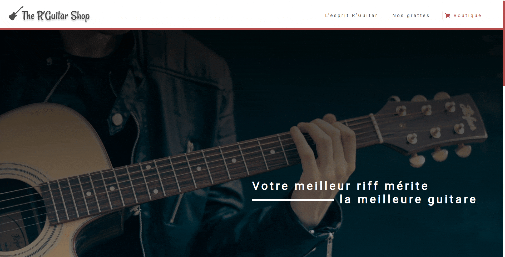
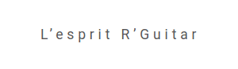
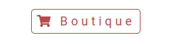

# Guitar Shop

**Project type:** Front-end web project.  
**Brief description:** Responsive one-page made after a maquette.  
**Technologies:** HTML5, CSS3.  

The R'Guitar Shop is a fictitious guitar selling company. This is an early project from the bootcamp written only in HTML and CSS. The goal was to make a responsive one-page after a [maquette](https://github.com/LycorisDev/web_onepage/tree/main/maquette).  

I took the liberty to add animations to make the project more alive. Customizing the scrollbar was also my initiative.  

<ins>Scroll animation</ins>  

<ins>Link animation</ins>  

<ins>Button animation</ins>  

<ins>Button animation with icon</ins>  

